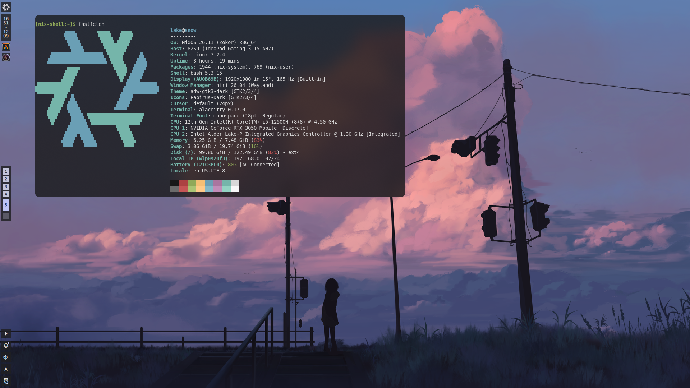

# NixOS Configuration

<p align="center">
  
</p>

My personal NixOS configuration built with NixOS Flakes and modular features.

## Setup

Clone the repository:

```bash
git clone https://github.com/dityaren/nixos.git
cd ./nixos
```

Make a copy of `nixos/modules/hosts/snow` in the same directory and rename it into your desired hostname,

Make changes into variables:

```text
modules/hosts/your-host-dir/vars.nix
```

Change the machine-specific values:

```nix
flake.vars = {
  username = "your-username";
  hostname = "your-hostname";
  stateVersion = "26.05";
  flakeRoot = "your-nixos-config-location/"; # End with /
};
```

Then rebuild:

```bash
sudo nixos-rebuild switch --flake your-nixos-config-location#your-hostname
```

## Structure

```text
.
├── flake.nix
├── flake.lock
└── modules/
    ├── hosts/
    │   └── (machine)/
    │       └── vars.nix
    │
    └── features/
        ├── ...
        ├── ...
        └── ...
```
